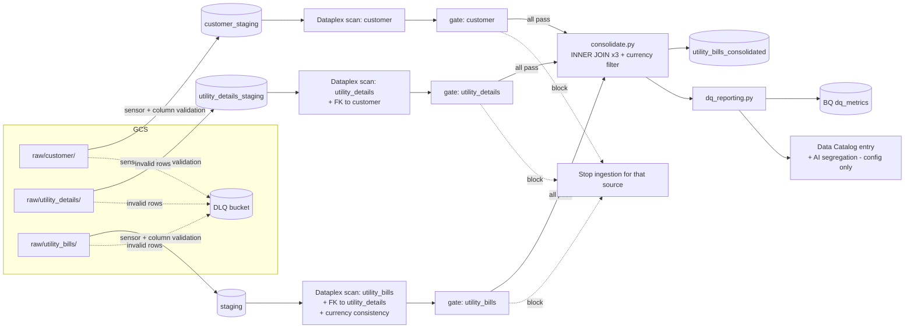
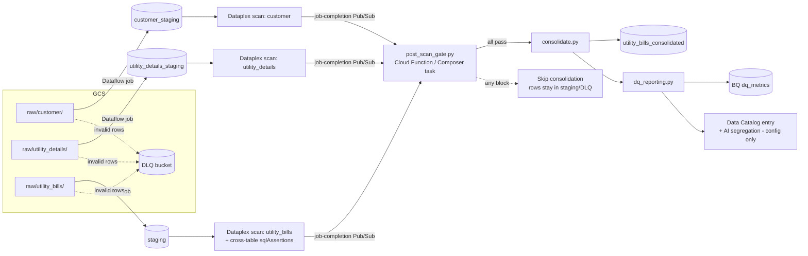

# Utility Bills Data Quality Framework

A small, config-driven framework that ingests **three related flat-file
sources** from GCS — `customer`, `utility_details`, and `utility_bills` —
validates every row/column independently per source, then validates
**across** them (referential integrity + attribute consistency) using
**Dataplex**, and materializes a single **consolidated output table**. All
dataset metadata, lineage, and DQ metrics are registered in **Data Catalog
(Knowledge Catalog)** under the scope of a single **DQ Agent**.

Two interchangeable ingestion architectures are provided. Both share the
same schemas, validation rules, DQ-agent thresholds, cross-table rules, and
catalog registration code — only the orchestration/compute layer differs.

## Data model

| Table | Key | Purpose |
|---|---|---|
| `customer_staging` | `customer_id` (PK) | name, email, region, `registered_currency` |
| `utility_details_staging` | `account_id` (PK), `customer_id` (FK → customer) | utility_type, meter_id, region |
| `staging` (utility_bills) | `account_id` (FK → utility_details) | bill_date, amount, currency |
| `utility_bills_consolidated` | — | denormalized join of all three, cross-validated rows only |

## Design principles

- **One schema per source, one set of rules each.** [schemas/customer_schema.yaml](schemas/customer_schema.yaml),
  [schemas/utility_details_schema.yaml](schemas/utility_details_schema.yaml), and
  [schemas/utility_bill_schema.yaml](schemas/utility_bill_schema.yaml) each define
  per-column type/required/regex/range/allowed-value rules once. Each is used
  directly by the Python validators (row-level, in-pipeline) and mirrored in
  a matching `dataplex/dq_scan_*.yaml` (column-level, via Dataplex Auto DQ).
- **Fail rows, not files.** Column validation only drops the individual
  rows that break a rule; every other row in the file still loads to its
  staging table. Failed rows are written to a DLQ in GCS with the specific
  error per column.
- **Dataplex finds invalid records at both the column and cross-table
  level.** Each source has its own Dataplex Data Quality scan. The
  `utility_bills` scan ([dataplex/dq_scan_utility_bills.yaml](dataplex/dq_scan_utility_bills.yaml))
  additionally carries two config-only `sqlAssertion` rules:
  - **Referential integrity** — every `account_id` must exist in
    `utility_details_staging` (and every `customer_id` there must exist in
    `customer_staging`, checked in that source's own scan).
  - **Attribute consistency** — a bill's `currency` must match the
    registered currency of the customer who owns that account.
  [pipeline/dataplex_gate.py](pipeline/dataplex_gate.py) reads each scan's BigQuery
  results export and applies the DQ agent's block thresholds
  (`enforce_block_threshold`, `enforce_block_count` in
  [pipeline/dq_agent_config.yaml](pipeline/dq_agent_config.yaml)) per source. If any
  source breaches its threshold, ingestion stops for that source and
  consolidation is skipped until it's fixed.
- **Consolidation is the final gate, too.** [pipeline/consolidate.py](pipeline/consolidate.py)
  builds `utility_bills_consolidated` with INNER JOINs across the three
  staging tables plus a currency-match WHERE clause — so even if a
  cross-table sqlAssertion rule's ratio stayed under threshold, any
  individual orphaned or currency-mismatched bill row is still excluded
  from the final output table.
- **One DQ Agent, one catalog registration path.** [pipeline/dq_reporting.py](pipeline/dq_reporting.py)
  writes DQ metrics to BigQuery and registers/updates the *consolidated
  table's* Data Catalog entry (metadata + lineage pointer + the DQ report)
  every run. Knowledge Catalog's AI-based classification of that metadata
  is enabled purely through config (`knowledge_catalog.use_ai_segmentation`
  in `dq_agent_config.yaml`) — no custom classification code.

## Architecture A: Cloud Composer (Airflow)

DAG: [airflow_dags/validate_ingest_dag.py](airflow_dags/validate_ingest_dag.py) — one
wait/validate/scan/gate branch per source, fanning in to a single
`consolidate_and_report` task.

Best when: ingestion is scheduled/event-driven at file-batch granularity,
and you want each source's validation plus the cross-table gate as
explicit, retryable, observable DAG tasks (Composer UI, SLAs, alerting on
task failure).

## Architecture B: Dataflow (Apache Beam)

Pipeline: [dataflow/beam_dq_pipeline.py](dataflow/beam_dq_pipeline.py) run once per
source (per-column validation as a Beam `ParDo` with tagged valid/invalid
outputs, parameterized by `--schema`/`--output_table`/`--dlq`) plus
[dataflow/post_scan_gate.py](dataflow/post_scan_gate.py) (gates all three
Dataplex scans, then consolidates and registers in the catalog — run once
after all three jobs complete).

Best when: higher file/row volume needs autoscaled parallel processing, or
ingestion is triggered per-file in near-real-time via Pub/Sub rather than on
a schedule. The DQ-scan/gate/consolidate/catalog step is deliberately kept
out of the Beam graph (avoid per-row external API calls) and run once per
batch of jobs instead.

## Shared components

| Component | Purpose |
|---|---|
| `schemas/customer_schema.yaml`, `utility_details_schema.yaml`, `utility_bill_schema.yaml` | Single source of truth for each source's column rules |
| [pipeline/validators.py](pipeline/validators.py) | Row/column-level rule evaluation, used by both the Airflow validator and the Beam `ParDo`, for all three sources |
| [pipeline/validator.py](pipeline/validator.py) | GCS file listing + per-file validation + BQ/DLQ writes (Airflow path) |
| [dataflow/beam_dq_pipeline.py](dataflow/beam_dq_pipeline.py) | Same column validation, expressed as a Beam pipeline (Dataflow path) |
| `dataplex/dq_scan_customer.yaml`, `dq_scan_utility_details.yaml`, `dq_scan_utility_bills.yaml` | Dataplex Auto DQ rule specs — column rules plus the cross-table `sqlAssertion` referential/consistency rules — Dataplex, not custom code, finds invalid records |
| [pipeline/dataplex_gate.py](pipeline/dataplex_gate.py) | Reads Dataplex scan results per source, applies DQ-agent thresholds, decides block/promote |
| [pipeline/consolidate.py](pipeline/consolidate.py) | Joins the three staging tables into `utility_bills_consolidated` — the final output table |
| [pipeline/dq_reporting.py](pipeline/dq_reporting.py) | Writes DQ metrics to BigQuery, registers the consolidated table's metadata/lineage in Data Catalog |
| [pipeline/dq_agent_config.yaml](pipeline/dq_agent_config.yaml) | DQ Agent scope: per-source thresholds/scan refs, consolidated output table name, Knowledge Catalog settings (AI segregation is config-only) |

## Setup (either architecture)

1. `pip install -r requirements.txt`
2. Create the BQ tables: `utility_bills.customer_staging`, `utility_bills.utility_details_staging`, `utility_bills.staging`, `utility_bills.utility_bills_consolidated`, `dq_admin.dq_metrics`, `dq_admin.dataplex_dq_results`.
3. Deploy the three Dataplex scans (see the header of each `dataplex/dq_scan_*.yaml` for the `gcloud dataplex datascans create` command), pointing the `utility_bills` scan's `sqlAssertion` rules at the actual project/dataset.
4. Create the Data Catalog entry group + tag template referenced in `pipeline/dq_agent_config.yaml`, and enable Knowledge Catalog AI segregation on it (console/config only).
5a. **Airflow**: deploy `airflow_dags/validate_ingest_dag.py` to Composer, set the `gcp_project`, `utility_bills_raw_bucket`, `utility_bills_dlq_bucket` Airflow variables.
5b. **Dataflow**: run `python -m dataflow.beam_dq_pipeline --runner=DataflowRunner ...` once per source (see header of that file), then run `python -m dataflow.post_scan_gate --project=$PROJECT --job_id customer=... --job_id utility_details=... --job_id utility_bills=...` after all three jobs and their Dataplex scans complete.
