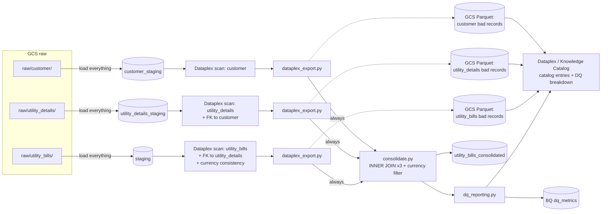
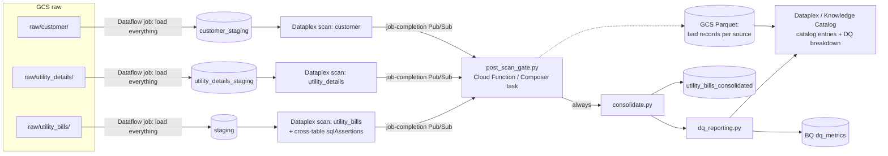

# Utility Bills Data Quality Framework

A small, config-driven framework that ingests **three related flat-file
sources** from GCS — `customer`, `utility_details`, and `utility_bills` —
**in full**, validates them entirely with **Dataplex** (column rules plus
cross-table referential/attribute checks), and turns Dataplex's findings
into a **Parquet file of bad records per source**, registered in
**Dataplex Catalog / Knowledge Catalog** (the same underlying service) so
they're visible on that dashboard. A single **consolidated output table**
is also materialized from the three staging tables. All of this sits under
the scope of a single **DQ Agent**.

Two interchangeable ingestion architectures are provided. Both share the
same schemas, Dataplex scan specs, export/catalog code, and consolidation
logic — only the orchestration/compute layer differs.

In medallion terms, the three `*_staging` tables are **Bronze** (raw,
ingested as-is), and `utility_bills_consolidated` is **Gold** (the
cross-source join). There's no separate Silver layer here yet — Dataplex's
findings currently flow straight from Bronze to the Parquet quarantine and
to Gold's join filter. See [demo/](demo/) for a from-scratch, one-table
Bronze → Silver → Gold pipeline (with an explicit Silver layer) that's
useful as a quick way to test each service end-to-end before touching this
larger framework; it's fully independent of everything below.

## How validation actually works here

1. **Ingest everything.** [pipeline/loader.py](pipeline/loader.py) (Airflow) /
   [dataflow/beam_dq_pipeline.py](dataflow/beam_dq_pipeline.py) (Dataflow) bulk-load
   every row of every file into its staging table, unmodified. Staging
   tables are all-`STRING` columns, so a malformed date, non-numeric
   amount, or anything else never fails the load — nothing is filtered
   before this point.
2. **Dataplex validates.** A Dataplex Auto Data Quality scan runs against
   each staging table using the rules in `dataplex/dq_scan_*.yaml` — the
   same column rules as before (non-null, regex, allowed values), plus two
   cross-table `sqlAssertion` rules on the `utility_bills` scan
   (referential integrity to `utility_details`/`customer`, and
   bill-currency-matches-customer-currency).
3. **Dataplex's own report becomes the source of truth for what's bad.**
   Every Dataplex rule that fails carries an auto-generated
   `failing_rows_query` — a SQL query that returns the actual
   non-conforming rows. [pipeline/dataplex_export.py](pipeline/dataplex_export.py)
   runs every failed rule's query for a scan job and unions the results
   (tagged with which rule/dimension each row failed) into
   **`dq_admin.quarantine_<source>`** — a real, kept BigQuery table, not a
   temp table. Because it's a genuine BigQuery table, it's **auto-cataloged
   by Dataplex Universal Catalog with a full schema and a data Preview
   tab** — no registration code needed to make the actual bad rows
   browsable in the dashboard. The same table is also extracted to a
   **Parquet file in GCS** (`gs://<quarantine_bucket>/quarantine/<source>/<job_id>/`)
   as a portable archival copy.
4. **The Parquet file gets its own catalog entry too.**
   `register_parquet_quarantine_in_catalog()` creates/updates an entry in
   Dataplex Universal Catalog (Knowledge Catalog) — via
   `dataplex_v1.CatalogServiceClient`, not the deprecated `datacatalog_v1`
   write API — pointing at that Parquet file, with a live breakdown of bad
   records by rule/dimension and a pointer to the `quarantine_<source>`
   table in its description. It shows up next to the `customer_staging`,
   `utility_bills_consolidated`, etc. entries on the same dashboard, but
   for browsing individual rows the BigQuery table (auto-cataloged) is the
   one with an actual data grid.
5. **Consolidation is a separate, always-on join.**
   [pipeline/consolidate.py](pipeline/consolidate.py) builds
   `utility_bills_consolidated` with an `INNER JOIN` across the three
   staging tables plus a currency-match `WHERE` clause — this naturally
   mirrors the same referential/consistency conditions Dataplex flags, so
   the consolidated table only contains cross-table-clean rows, without
   ever touching or filtering the staging tables themselves.

Nothing in this pipeline blocks or removes data from staging — Dataplex
scan alerts (`pipeline/dataplex_gate.py`) are purely informational, logged
for the DQ agent owner.

## Data model

| Table / artifact | Purpose |
|---|---|
| `customer_staging`, `utility_details_staging`, `staging` (bills) | Every row of every file, ingested as-is, all-`STRING` columns |
| `utility_bills_consolidated` | Denormalized join of all three, cross-table-clean rows only |
| `dq_admin.quarantine_<source>` | Bad records per source, as found by Dataplex, tagged by rule — a real BigQuery table (overwritten each scan run), auto-cataloged with a data Preview tab |
| `gs://<quarantine_bucket>/quarantine/<source>/<job_id>/*.parquet` | Portable archival copy of the same bad records, one snapshot per scan job |
| Catalog entry `<source>-quarantine` | Points at the Parquet above, with a DQ breakdown and a pointer to the BigQuery table — visible on the catalog dashboard |

## Architecture A: Cloud Composer (Airflow)

DAG: [airflow_dags/validate_ingest_dag.py](airflow_dags/validate_ingest_dag.py) — one
wait/load/scan/export branch per source, fanning in with
`trigger_rule=all_done` to a single `consolidate_and_report` task.

Best when: ingestion is scheduled/event-driven at file-batch granularity,
and you want each source's load, scan, and export as explicit, retryable,
observable DAG tasks (Composer UI, SLAs, alerting on the DQ agent's alert
flag without ever failing a task over bad data).

## Architecture B: Dataflow (Apache Beam)

Pipeline: [dataflow/beam_dq_pipeline.py](dataflow/beam_dq_pipeline.py) run once per
source (parses the CSV and writes every row straight to staging - no
validation in the Beam graph at all) plus
[dataflow/post_scan_gate.py](dataflow/post_scan_gate.py) (pulls each
source's Dataplex findings into Parquet, registers them in the catalog,
then consolidates - run once after all three jobs and scans complete).

Best when: higher file/row volume needs autoscaled parallel processing, or
ingestion is triggered per-file in near-real-time via Pub/Sub rather than
on a schedule.

## Shared components

| Component | Purpose |
|---|---|
| `schemas/customer_schema.yaml`, `utility_details_schema.yaml`, `utility_bill_schema.yaml` | Reference column definitions each `dataplex/dq_scan_*.yaml` mirrors |
| [pipeline/loader.py](pipeline/loader.py) | Bulk-loads every row of a source's files into its staging table, unfiltered (Airflow path) |
| [dataflow/beam_dq_pipeline.py](dataflow/beam_dq_pipeline.py) | Same bulk ingestion, expressed as a Beam pipeline (Dataflow path) |
| `dataplex/dq_scan_customer.yaml`, `dq_scan_utility_details.yaml`, `dq_scan_utility_bills.yaml` | Dataplex Auto DQ rule specs — column rules plus the cross-table `sqlAssertion` referential/consistency rules — this is where validation actually happens |
| [pipeline/dataplex_gate.py](pipeline/dataplex_gate.py) | Reads a scan's results for reporting, computes an informational `alert` flag — never blocks anything |
| [pipeline/dataplex_export.py](pipeline/dataplex_export.py) | Pulls every failed rule's `failing_rows_query`, exports the actual bad records to Parquet in GCS, and registers that file as a catalog entry (Dataplex Universal Catalog) |
| [pipeline/consolidate.py](pipeline/consolidate.py) | Joins the three staging tables into `utility_bills_consolidated` |
| [pipeline/dq_reporting.py](pipeline/dq_reporting.py) | Writes DQ metrics to BigQuery, registers dataset metadata/lineage in Data Catalog |
| [pipeline/dq_agent_config.yaml](pipeline/dq_agent_config.yaml) | DQ Agent scope: per-source alert thresholds/scan refs, quarantine GCS bucket, consolidated output table name, Knowledge Catalog settings (AI segregation is config-only) |

## Setup (either architecture)

1. `pip install -r requirements.txt`
2. Create the BQ tables (all-`STRING` schemas): `utility_bills.customer_staging`, `utility_bills.utility_details_staging`, `utility_bills.staging`, `dq_admin.dq_metrics`, `dq_admin.dataplex_dq_results`. (`utility_bills.utility_bills_consolidated` is created automatically by `pipeline/consolidate.py` on first run.)
3. Create the `quarantine_gcs_bucket` from `pipeline/dq_agent_config.yaml`.
4. Deploy the three Dataplex scans (see the header of each `dataplex/dq_scan_*.yaml` for the `gcloud dataplex datascans create` command), pointing the `utility_bills` scan's `sqlAssertion` rules at the actual project/dataset.
5. Create the Data Catalog entry group + tag template referenced in `pipeline/dq_agent_config.yaml`, and enable Knowledge Catalog AI segregation on it (console/config only).
6a. **Airflow**: deploy `airflow_dags/validate_ingest_dag.py` to Composer, set the `gcp_project` and `utility_bills_raw_bucket` Airflow variables.
6b. **Dataflow**: run `python -m dataflow.beam_dq_pipeline --runner=DataflowRunner ...` once per source (see header of that file), then run `python -m dataflow.post_scan_gate --project=$PROJECT --job_id customer=... --job_id utility_details=... --job_id utility_bills=...` after all three jobs and their Dataplex scans complete.

See [DEPLOYMENT.md](DEPLOYMENT.md) for the full command-by-command walkthrough.
