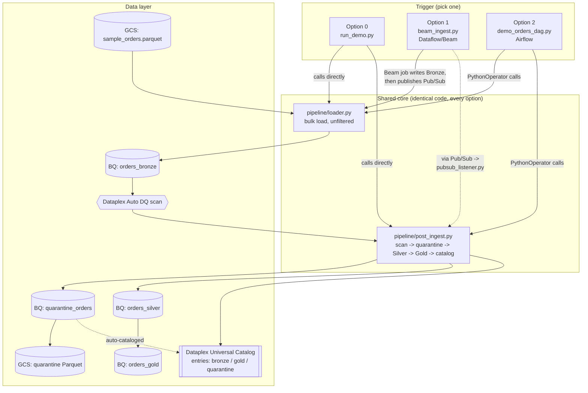
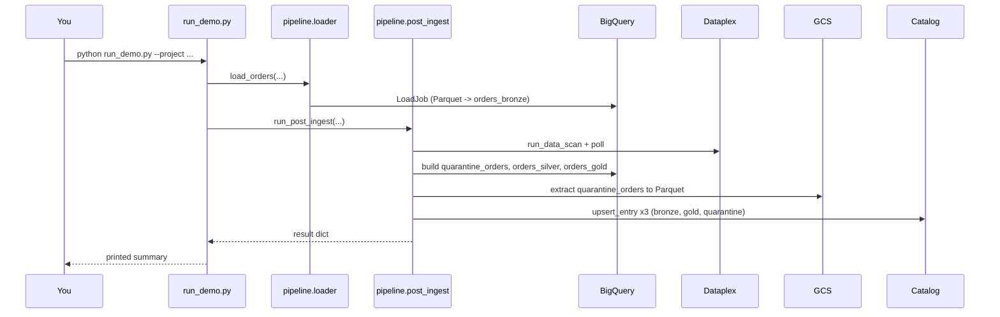
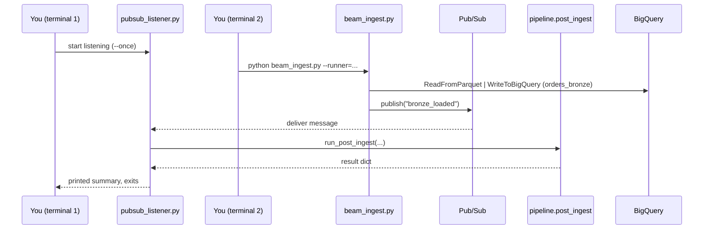
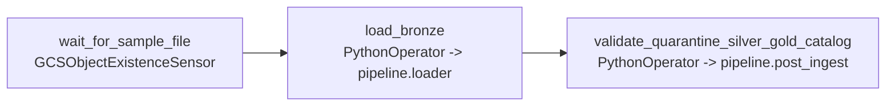

# Demo Architecture Reference

This document is the deep reference for the `demo/` folder: what every
file is for, what it takes in and produces, and how the pieces fit
together across all three ways of running the pipeline. [README.md](README.md)
is the quick-start; this is the "why does this file exist and what
exactly does it do" document.

## 1. What this demo is

A one-table (`orders`) implementation of the main framework's pattern —
**ingest everything, let Dataplex validate, make the bad records visible,
build a clean/curated layer on top** — small enough to stand up and tear
down in minutes, but wired to real GCP services rather than mocks. It
exists so each service (GCS, BigQuery, Dataplex Data Quality, Dataplex
Universal Catalog / Knowledge Catalog, Dataflow, Pub/Sub, Airflow) can be
verified working in isolation before trusting the larger 3-table
`customer`/`utility_details`/`utility_bills` framework in the parent
directory.

## 2. System overview

The point of this diagram: **no matter which of the three trigger paths
you use, the exact same `loader.py` and `post_ingest.py` code runs.** Only
the thing that calls them differs. This is deliberate — it's what proves
the pipeline's core logic is orchestration-agnostic, the same property the
main framework's Airflow/Dataflow split relies on.

## 3. Design principles

- **Ingest everything, validate after.** Nothing is filtered at load time.
  Bronze is all-`STRING` so a malformed value can never fail the load —
  Dataplex is the only thing that decides what's valid, after the fact.
- **Dataplex is the single source of truth for "bad."** No column-rule
  logic is duplicated in Python. Every downstream decision (what goes to
  quarantine, what's excluded from Silver) is derived from the same
  Dataplex scan result via its auto-generated `failing_rows_query` per
  rule — never a second, independently-maintained implementation of the
  same checks.
- **Real BigQuery tables get free catalog visibility.** `quarantine_orders`,
  `orders_bronze`, and `orders_gold` are genuine BigQuery tables, which
  Dataplex Universal Catalog auto-discovers with a full schema and data
  Preview tab — no registration code needed for that. Explicit
  `pipeline/catalog.py` calls are only for adding a human-readable
  description/breakdown on top, and for the Parquet file (which isn't a
  BigQuery resource and so isn't auto-cataloged).
- **One core, three triggers.** `pipeline/loader.py` and
  `pipeline/post_ingest.py` don't know or care whether they were called by
  a synchronous script, an Airflow task, or a Pub/Sub message handler.
  That separation is what let Options 1 and 2 be added without touching
  the validation/quarantine/Silver/Gold logic at all.
- **Bronze → Silver → Gold, consolidation reserved for Gold.** This
  one-table demo has no cross-source join, so Gold is a plain aggregate.
  The main framework's `pipeline/consolidate.py` is the same Gold-layer
  concept applied to three sources instead of one.

## 4. Architecture per trigger option

### Option 0 — synchronous script

One process, one Python interpreter, fully sequential. Fastest option,
best for a first correctness check. See `README.md`'s "Option 0" section
for the numbered step breakdown.

### Option 1 — Dataflow + Pub/Sub

Two independent processes. The listener must already be subscribed before
the Beam job publishes — Pub/Sub doesn't replay to a subscription that
didn't exist at publish time. This is the closest analog in the demo to a
real streaming/event-driven pipeline, and it's the concrete implementation
of the pattern the main framework's README only describes ("wire this
into a Cloud Function on the Dataflow job-completion Pub/Sub topic").

### Option 2 — Airflow

Three tasks, one linear dependency chain, `schedule_interval=None`
(trigger manually for a demo run). Runnable either as a local
`airflow standalone` instance in Cloud Shell (fast, no Composer cost) or
deployed to a real Cloud Composer environment — see `DEPLOYMENT.md` §6c
for both.

## 5. Data model

| Table / artifact | Layer | Built by | Contents |
|---|---|---|---|
| `orders_bronze` | Bronze | `pipeline/loader.py` (Option 0/2) or `dataflow/beam_ingest.py` (Option 1) | Every row of `sample_orders.parquet`, unmodified, all-`STRING` columns |
| *(Dataplex scan result)* | — | Dataplex Auto DQ (`orders-dq-scan`) | Pass/fail count and `failing_rows_query` per rule, per run — not a table, a scan job result |
| `quarantine_orders` | *(quarantine)* | `pipeline/dataplex_export.py` | Every row that failed any rule, tagged with `failed_rule`/`dimension`/`scan_job_id` — overwritten (`CREATE OR REPLACE`) each run, kept (not dropped), auto-cataloged |
| `gs://.../quarantine/orders/<job_id>/*.parquet` | *(quarantine, archival)* | `pipeline/dataplex_export.py` | Portable Parquet snapshot of `quarantine_orders` for that specific scan job |
| `orders_silver` | Silver | `pipeline/silver.py` | Bronze rows whose key never appeared in any `failing_rows_query`, cast to real types (`amount` → `FLOAT64`, `order_date` → `DATE`) |
| `orders_gold` | Gold | `pipeline/gold.py` | `order_count`, `total_revenue`, `avg_order_value` grouped by `status`, from Silver |
| `dq_metrics` | *(reporting)* | `pipeline/dq_reporting.py` | One row per run: rows loaded, rows quarantined |
| Catalog entries `orders-bronze` / `orders-gold` / `orders-quarantine` | *(catalog)* | `pipeline/catalog.py` via `dq_reporting.py` / `dataplex_export.py` | Generic-type entries under the `dq-demo-group` entry group, each with a description carrying the relevant summary |

## 6. Component reference

### Data & config

**`data/sample_orders.parquet`**
- **Purpose:** the fixed input dataset — 1000 rows, ~85% clean / ~15%
  each carrying exactly one defect, one row per defect type so every rule
  in the scan spec gets exercised.
- **Format note:** every column is Arrow `string`, not typed — a real
  `FLOAT64`/`DATE` column would reject bad values (`"N/A"`, `"15-01-2026"`)
  at *write* time, before Dataplex ever saw them. Matches the all-`STRING`
  Bronze table it loads into.
- **Consumed by:** `pipeline/loader.py` (Options 0/2) and
  `dataflow/beam_ingest.py` (Option 1) — both just read it, neither cares
  which loaded it.

**`data/generate_sample_orders.py`**
- **Purpose:** deterministic generator (fixed seed) for the file above.
  Re-run it to change scale (`NUM_ROWS`) or defect density (`BAD_RATIO`),
  or to regenerate an identical file.
- **Inputs:** none (constants at the top of the file).
- **Outputs:** overwrites `data/sample_orders.parquet`; prints a
  defect-count breakdown to stdout.
- **Dependency:** `pyarrow` (only needed to run this script, not the demo itself).

**`schema/orders_schema.yaml`**
- **Purpose:** human-readable documentation of the column rules — type,
  required, regex, range, allowed values. Not read by any code path; it's
  the "spec" that `dataplex/dq_scan_orders.yaml` is hand-translated from,
  kept for readability (same convention the main framework uses).

**`dataplex/dq_scan_orders.yaml`**
- **Purpose:** the actual validation logic. A Dataplex Auto Data Quality
  spec — 7 built-in expectation rules (non-null, regex, allowed-set,
  uniqueness) plus one `sqlAssertion` rule for `amount` (since it's
  ingested as `STRING`, "is it a non-negative number" has to be expressed
  as `SAFE_CAST(...) IS NULL OR ... < 0`).
- **Consumed by:** the Dataplex service itself, once deployed via
  `gcloud dataplex datascans create` (see `DEPLOYMENT.md` §4). Not parsed
  by any Python in this repo.
- **Naming constraint baked in:** every `name:` field uses hyphens, never
  underscores — Dataplex rejects underscore rule names outright.

### Core pipeline library (`pipeline/`)

**`pipeline/loader.py`**
- **Purpose:** bulk-load every row of the input file into `orders_bronze`,
  unconditionally.
- **Inputs:** `project`, GCS `bucket`/`prefix`, destination `dataset`/`table`.
- **Outputs:** rows appended to Bronze; returns `{table, rows_loaded}`.
- **Key behavior:** a plain BigQuery `LoadJobConfig` (`WRITE_APPEND`,
  `ignore_unknown_values=True`, `allow_jagged_rows=True`) — no per-row
  Python validation logic at all. This is what makes "ingest everything"
  true by construction rather than by convention.

**`pipeline/dataplex_export.py`**
- **Purpose:** turns a Dataplex scan job's results into (a) a kept,
  browsable BigQuery table and (b) an archival Parquet file, then
  registers the latter in the catalog.
- **`run_scan_and_wait(project, location, data_scan_id)`** — triggers the
  named scan via `DataScanServiceClient.run_data_scan` and polls
  `get_data_scan_job` until it reaches a terminal state. Returns the job ID.
- **`get_scan_job_rule_results(...)`** — fetches the job with
  `view=FULL` (via an explicit `GetDataScanJobRequest` — `view` is an
  optional field, not flattened as a kwarg on this client version) and
  extracts, per rule: name, column, dimension, evaluated/passed counts,
  and `failing_rows_query` (Dataplex's own auto-generated SQL for finding
  that rule's bad rows).
- **`export_bad_records_to_parquet(...)`** — for every rule with
  failures, wraps its `failing_rows_query` (stripping the trailing `;`
  Dataplex appends, which otherwise breaks once embedded in
  `FROM (...)`), tags the result with `failed_rule`/`dimension`/
  `scan_job_id`, and `UNION ALL`s everything into `quarantine_orders`
  (`CREATE OR REPLACE` — kept, not a temp table). Extracts that table to
  Parquet in GCS as an archival copy. Returns row counts, a
  rule/dimension breakdown, the GCS URI, and the BigQuery table name.
- **`register_parquet_quarantine_in_catalog(...)`** — upserts the
  `orders-quarantine` catalog entry, pointing at the Parquet file and
  describing both it and the BigQuery table.

**`pipeline/silver.py`**
- **Purpose:** build the "clean" layer from Bronze, using Dataplex's own
  verdict rather than re-implementing any rule.
- **`build_silver_table(project, dataset, rule_results, ...)`** —
  `CREATE OR REPLACE TABLE orders_silver AS SELECT ... FROM orders_bronze
  WHERE order_id NOT IN (<union of every failing rule's failing_rows_query,
  each selecting just order_id>)`, casting `amount`/`order_date` to real
  types in the same `SELECT`. Same trailing-`;` stripping as
  `dataplex_export.py` (this file embeds `failing_rows_query` a second,
  independent time, so it needed the identical fix).

**`pipeline/gold.py`**
- **Purpose:** the business-consumable rollup.
- **`build_gold_table(project, dataset, silver_table, gold_table)`** —
  `CREATE OR REPLACE TABLE orders_gold AS SELECT status, COUNT(*),
  SUM(amount), AVG(amount) FROM orders_silver GROUP BY status`. Nothing
  fancier — this is where a multi-source consolidation join would replace
  the aggregate if there were more than one Silver table (see the main
  framework's `pipeline/consolidate.py`).

**`pipeline/catalog.py`**
- **Purpose:** the one place that talks to Dataplex Universal Catalog /
  Knowledge Catalog, shared by every other module that needs to register
  something.
- **`ensure_entry_group(project, location, entry_group_id)`** — creates
  the entry group via `CatalogServiceClient.create_entry_group` (an
  async LRO — `.result(60)` waits for it), swallowing `AlreadyExists`.
- **`upsert_entry(project, location, entry_group_id, entry_id,
  display_name, description, resource, system)`** — builds an `Entry`
  using the **public system "generic" entry type and aspect type**
  (`projects/dataplex-types/locations/global/entryTypes/generic` /
  `.../aspectTypes/generic`) — no custom `EntryType`/`AspectType`
  provisioning needed. Tries `create_entry`; on `AlreadyExists`, updates
  instead (`update_mask` on `aspects`/`entry_source.description`/
  `entry_source.resource`).
- **Why this exists as its own module:** this is the migration off the
  deprecated `datacatalog_v1.DataCatalogClient` API, which is blocked for
  write operations on newer projects. Everything here uses
  `dataplex_v1.CatalogServiceClient` instead — the current, non-deprecated
  API for the same underlying service.
- **Constraint baked in:** entry group IDs and entry IDs allow only
  letters, numbers, and hyphens — callers are responsible for passing
  already-valid IDs (see `dq_reporting.register_dataset_in_datacatalog` in
  the main framework, which normalizes with `.replace('_', '-')` for
  callers that don't).

**`pipeline/dq_reporting.py`**
- **Purpose:** the "good news" reporting path — metrics to BigQuery,
  metadata to the catalog — as opposed to `dataplex_export.py`'s "bad
  news" path.
- **`write_metrics_to_bq(project, dataset, table, metrics)`** — a single
  `insert_rows_json` call.
- **`register_table_in_catalog(project, location, entry_group_id,
  entry_id, metadata)`** — thin wrapper over `catalog.upsert_entry`,
  JSON-dumping `metadata` into the entry's description.

**`pipeline/post_ingest.py`**
- **Purpose:** the shared core that all three trigger options call after
  Bronze is loaded — the reason this demo has one validation/quarantine/
  Silver/Gold/catalog implementation instead of three.
- **`run_post_ingest(project, location, quarantine_bucket, entry_group)`**
  — queries Bronze's row count directly (rather than accepting it as an
  argument) specifically so it's decoupled from *how* Bronze was loaded;
  then calls, in order: `run_scan_and_wait` → `get_scan_job_rule_results`
  → `export_bad_records_to_parquet` → `register_parquet_quarantine_in_catalog`
  → `build_silver_table` → `build_gold_table` → `write_metrics_to_bq` →
  `register_table_in_catalog` (bronze) → `register_table_in_catalog` (gold).
  Returns a result dict every caller (`run_demo.py`, `pubsub_listener.py`,
  the Airflow DAG) prints or logs.

### Entry points / orchestrators

**`run_demo.py`** (Option 0)
- **Purpose:** the fastest, simplest way to run everything — one process,
  one command.
- **Does:** parses `--project`/`--raw_bucket`/`--quarantine_bucket`, calls
  `pipeline.loader.load_orders`, then `pipeline.post_ingest.run_post_ingest`,
  then pretty-prints the rule results and final counts.

**`dataflow/beam_ingest.py`** (Option 1, ingestion half)
- **Purpose:** load Bronze via an actual Apache Beam pipeline instead of a
  plain BigQuery load job, so the demo exercises Dataflow specifically.
- **Does:** `beam.io.ReadFromParquet(input)` → `beam.io.WriteToBigQuery(
  output_table, WRITE_APPEND)`; after the `with beam.Pipeline(...)` block
  exits (which blocks until the job finishes, for both `DirectRunner` and
  `DataflowRunner`), publishes a one-line JSON message to the given
  Pub/Sub topic if `--topic` was passed.
- **Runners:** `DirectRunner` (runs locally, still reads/writes real GCP
  resources, fast) or `DataflowRunner` (an actual managed Dataflow job,
  needs `--region`/`--temp_location`).

**`pubsub_listener.py`** (Option 1, processing half)
- **Purpose:** the event-driven trigger for `post_ingest`, decoupled from
  ingestion into a separate process.
- **Does:** subscribes to the given Pub/Sub subscription; on message
  receipt, calls `run_post_ingest(...)`, `ack()`s on success or `nack()`s
  (for redelivery) on failure. `--once` cancels the streaming pull after
  the first message — the right mode for a single demo run; omit it to
  keep listening across multiple ingestion jobs.

**`airflow_dags/demo_orders_dag.py`** (Option 2)
- **Purpose:** the Airflow orchestration path, structurally identical to
  the main framework's `validate_ingest_dag.py` but for one table and two
  phases instead of three sources and a consolidation fan-in.
- **Tasks:** `wait_for_sample_file` (`GCSObjectExistenceSensor`) →
  `load_bronze` (`PythonOperator` → `pipeline.loader.load_orders`) →
  `validate_quarantine_silver_gold_catalog` (`PythonOperator` →
  `pipeline.post_ingest.run_post_ingest`).
- **Deployment:** either `airflow standalone` locally in Cloud Shell (the
  DAG file's header has the exact commands) or a real Cloud Composer
  environment — both documented in `DEPLOYMENT.md` §6c.

### Ops / docs

**`requirements.txt`** — pinned dependencies, annotated by which option
needs which package (Option 0 needs only `google-cloud-bigquery` +
`google-cloud-dataplex`; Option 1 additionally needs `apache-beam[gcp]` +
`google-cloud-pubsub`; Option 2's Airflow install is deliberately kept
separate since `apache-airflow[gcp]` pulls in a lot and can conflict with
these pins).

**`DEPLOYMENT.md`** — the command-by-command setup and run guide: shared
setup (§0-5, §7-9) plus one run section per option (§6a/6b/6c).

**`README.md`** — the quick-start: what the demo is, the three-option
comparison table, the sample data's defect breakdown, and the fastest path
to a first successful run.

## 7. GCP services matrix

| Service | Used by | IAM role needed | Where to look afterward |
|---|---|---|---|
| Cloud Storage | `loader.py`, `beam_ingest.py`, `dataplex_export.py` | `roles/storage.objectAdmin` | The two buckets (`raw_bucket`, `quarantine_bucket`) |
| BigQuery | every `pipeline/*.py` module | `roles/bigquery.dataEditor`, `roles/bigquery.jobUser` | `dq_demo` dataset: `orders_bronze`, `orders_silver`, `orders_gold`, `quarantine_orders`, `dq_metrics` |
| Dataplex Data Quality | `dataplex_export.py` (`run_scan_and_wait`, `get_scan_job_rule_results`) | `roles/dataplex.dataScanEditor` | Dataplex → Governance → Data Quality → `orders-dq-scan` |
| Dataplex Universal Catalog / Knowledge Catalog | `pipeline/catalog.py` | `roles/dataplex.catalogEditor` | Dataplex → Catalog → entry group `dq-demo-group` |
| Dataflow | `dataflow/beam_ingest.py` (`--runner=DataflowRunner` only) | `roles/dataflow.developer` (+ `roles/iam.serviceAccountUser` if using a non-default worker SA) | Dataflow → Jobs, while a `DataflowRunner` job is in flight |
| Pub/Sub | `beam_ingest.py` (publish), `pubsub_listener.py` (subscribe) | `roles/pubsub.editor` | Pub/Sub → Topics/Subscriptions: `dq-demo-ingest-complete` |
| Cloud Composer (optional) | `demo_orders_dag.py`, if deployed rather than run via `airflow standalone` | project-level Composer setup roles | Composer environment `dq-demo-composer`, Airflow UI |

## 8. See also

- [README.md](README.md) — quick start, option comparison, sample data.
- [DEPLOYMENT.md](DEPLOYMENT.md) — exact commands for setup and all three
  run options, plus teardown.
- `../README.md` — the main 3-table framework this demo is a scaled-down
  proof-of-concept for.
