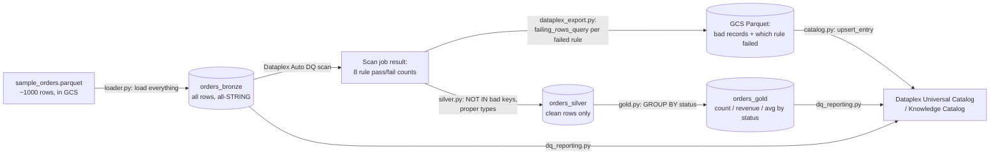
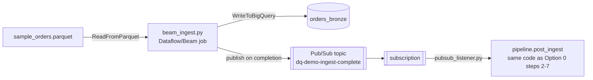

# Demo: One-Table Bronze → Silver → Gold Pipeline

A minimal, self-contained pipeline built to let you **test every service in
the main framework in isolation**. One table lineage (`orders`: Bronze →
Silver → Gold), one GCS bucket for input, one GCS bucket for bad-record
output, one Dataplex scan, one Dataplex Universal Catalog (Knowledge
Catalog) entry group - and three interchangeable ways to trigger the
pipeline, so **GCS, BigQuery, Dataplex, Knowledge Catalog, Dataflow,
Pub/Sub, and Airflow** all get exercised somewhere in this folder:

| # | How it runs | Time | What it adds over Option 0 |
|---|---|---|---|
| **0** | [run_demo.py](run_demo.py) - one process, synchronous | ~2 min | Nothing extra - fastest way to check the whole flow works |
| **1** | [dataflow/beam_ingest.py](dataflow/beam_ingest.py) (Dataflow/Beam) publishes to **Pub/Sub** on completion; [pubsub_listener.py](pubsub_listener.py) picks it up | ~5 min | Exercises Dataflow and Pub/Sub; ingestion and validation run as two decoupled processes, like a real event-driven pipeline |
| **2** | [airflow_dags/demo_orders_dag.py](airflow_dags/demo_orders_dag.py) | ~10-25 min | Exercises Airflow - runnable locally (`airflow standalone`, no Composer cost) or on a real Composer environment |

All three call the exact same [pipeline/loader.py](pipeline/loader.py) and
[pipeline/post_ingest.py](pipeline/post_ingest.py) code - only the
trigger/orchestration differs, the same way the main framework's Airflow
and Dataflow architectures share code and differ only in orchestration.

**For a detailed, component-by-component reference and the full system
architecture (diagrams for all three options, a data model table, a GCP
services/IAM matrix, and a purpose/inputs/outputs writeup for every single
file), see [ARCHITECTURE.md](ARCHITECTURE.md).** This README stays focused
on getting a first run working.

Catalog registration uses `dataplex_v1.CatalogServiceClient`
([pipeline/catalog.py](pipeline/catalog.py)), not the older
`datacatalog_v1` API - Data Catalog's write API is being deprecated and is
already blocked on newer projects.

This folder is fully independent of the rest of the repository - it has
its own `requirements.txt`, its own copies of the loader/export/reporting
modules, and its own Dataplex scan spec. Nothing here imports from
`../pipeline`. You can deploy it, poke at it, and tear it down without
touching the 3-table `customer`/`utility_details`/`utility_bills`
framework at all.

## Table architecture: Bronze → Silver → Gold

| Layer | Table | Contents |
|---|---|---|
| **Bronze** | `orders_bronze` | Every row of the raw Parquet file, ingested as-is, all-`STRING` columns. Nothing is ever filtered out of Bronze - it's the permanent, unmodified record of what was received. |
| **Silver** | `orders_silver` | Bronze rows that passed *every* Dataplex rule, with proper types (`amount` as `FLOAT64`, `order_date` as `DATE`). Built by excluding, via `NOT IN`, every key Dataplex's own `failing_rows_query` returned for any failed rule - so Silver and the quarantine Parquet file are two views of the exact same Dataplex verdict, never independently maintained logic. |
| **Gold** | `orders_gold` | A business-consumable rollup over Silver: order count, total revenue, and average order value per `status`. This is also where a **multi-source consolidation join belongs**, once there's more than one Silver table to bring together - see the main framework's `pipeline/consolidate.py`, which is exactly that pattern applied to three sources instead of one. This one-table demo has nothing to consolidate, so Gold here is a straight aggregate. |
| *(quarantine)* | GCS Parquet + catalog entry | Not a BigQuery table - Dataplex's bad-record findings, exported once per scan run. Sits alongside the three layers as the DQ agent's audit trail. |



## What it demonstrates

| Service | What you'll see |
|---|---|
| **Cloud Storage** | The raw Parquet file lands in a GCS bucket; the bad records Dataplex finds are exported back to GCS as a (separate) Parquet file |
| **BigQuery** | Bronze is bulk-loaded unfiltered; Silver, Gold, and `quarantine_orders` (the actual bad rows, kept and overwritten each run) are derived tables rebuilt (`CREATE OR REPLACE`) on every run |
| **Dataplex (Data Quality)** | A Dataplex Auto DQ scan validates Bronze against 8 rules (not-null, regex format, allowed values, numeric range, uniqueness) - this is the actual validation engine, not custom Python code, and it's also what decides which rows make it into Silver |
| **Dataplex Universal Catalog / Knowledge Catalog** | Three entries appear in the catalog (`dataplex_v1.CatalogServiceClient`, the generic system entry type - no custom EntryType/AspectType setup needed): `orders-bronze` and `orders-gold` (each with a DQ/row-count summary in their description) and `orders-quarantine`, whose linked resource is the bad-records Parquet file and whose description points to the `quarantine_orders` BigQuery table. That table is a *fourth*, unregistered piece of catalog visibility: because it's a real BigQuery table, Dataplex auto-catalogs it with its own schema and a data **Preview** tab, showing the actual failed rows - no registration code needed for that part |
| **Dataflow** (Option 1) | [dataflow/beam_ingest.py](dataflow/beam_ingest.py) reads the Parquet file with `beam.io.ReadFromParquet` and writes every row to Bronze with `beam.io.WriteToBigQuery` - runnable with `DirectRunner` (local, fast) or `DataflowRunner` (the actual managed service) |
| **Pub/Sub** (Option 1) | `beam_ingest.py` publishes an ingest-complete message after the Beam job finishes; [pubsub_listener.py](pubsub_listener.py) subscribes and triggers `pipeline.post_ingest` on receipt - decoupling ingestion from validation the way a real streaming/event-driven pipeline would |
| **Airflow** (Option 2) | [airflow_dags/demo_orders_dag.py](airflow_dags/demo_orders_dag.py): a `GCSObjectExistenceSensor` waits for the file, then two `PythonOperator` tasks run `pipeline.loader` and `pipeline.post_ingest` - runnable via `airflow standalone` locally or on Cloud Composer |

## The data

[data/sample_orders.parquet](data/sample_orders.parquet) has **1000 rows**,
generated by [data/generate_sample_orders.py](data/generate_sample_orders.py)
with a fixed seed (deterministic - re-running the generator produces the
same file). ~85% (850 rows) are clean; ~15% (150 rows) each carry exactly
one deliberate defect, roughly evenly split across every rule:

| Defect | Rule it fails | Typical count |
|---|---|---|
| `bad_order_id_format` | `order_id` doesn't match `^ORD[0-9]{6}$` | ~25 |
| `bad_status` | `status` not in the allowed set (e.g. `IN_ORBIT`, `RETURNED`) | ~22 |
| `duplicate_order_id` | `order_id` uniqueness | ~20 |
| `negative_amount` | `amount` non-negative check | ~19 |
| `missing_email` | `customer_email` not null | ~19 |
| `bad_date_format` | `order_date` doesn't match `YYYY-MM-DD` | ~18 |
| `bad_email` | `customer_email` regex | ~16 |
| `non_numeric_amount` | `amount` isn't a number at all | ~11 |

Every column is written as Arrow `string` type in the Parquet file - not
`FLOAT64`/`DATE` - specifically so values like `amount="N/A"` or a negative
amount can exist in the file at all; a typed Parquet column would reject
those at write time, before Dataplex ever got a chance to catch them. This
mirrors the all-`STRING` Bronze table it loads into.

Regenerate or resize the sample with:

```bash
pip install pyarrow
python demo/data/generate_sample_orders.py   # edit NUM_ROWS / BAD_RATIO at the top to change scale
```

Expect roughly **850 clean rows in Silver** and **~150 rows quarantined**
to the Parquet file after a run (exact counts print at the end of
`run_demo.py`, and the generator itself prints the breakdown it produced).

## Schema and rules

[schema/orders_schema.yaml](schema/orders_schema.yaml) is the human-readable
reference; [dataplex/dq_scan_orders.yaml](dataplex/dq_scan_orders.yaml) is
what Dataplex actually runs - the two are kept in sync by hand, same
convention as the main framework. The eight rules:

1. `order_id` not null
2. `order_id` matches `^ORD[0-9]{6}$`
3. `order_id` unique
4. `customer_email` not null
5. `customer_email` matches a basic email pattern
6. `status` in `{PENDING, SHIPPED, DELIVERED, CANCELLED}`
7. `order_date` matches `YYYY-MM-DD`
8. `amount` is a non-negative number (one `sqlAssertion`, since the column
   is ingested as `STRING`)

## Option 0: run_demo.py (one process, synchronous)

1. **Bronze** - `pipeline/loader.py` bulk-loads every row of the Parquet
   file into `orders_bronze`. Nothing is filtered; malformed values can't
   fail a `STRING` load.
2. **Validate** - `pipeline/dataplex_export.run_scan_and_wait()` triggers
   the `orders-dq-scan` Dataplex job via the API and polls until it
   finishes - no manual console clicking needed.
3. **Inspect** - the script prints a PASS/FAIL line per rule with the
   failing row count, straight from the scan job's results.
4. **Quarantine** - for every failed rule, Dataplex hands back a
   `failing_rows_query`: the actual SQL it used to find the bad rows.
   `dataplex_export.export_bad_records_to_parquet()` runs each of those,
   unions the results (tagged with which rule/dimension failed) into the
   kept `quarantine_orders` BigQuery table, extracts that to a Parquet
   file in your quarantine bucket, and registers the `orders-quarantine`
   catalog entry (`pipeline/catalog.py`).
5. **Silver** - `pipeline/silver.py` rebuilds `orders_silver` from Bronze,
   excluding any row whose key showed up in a `failing_rows_query`, and
   casting `amount`/`order_date` to real types.
6. **Gold** - `pipeline/gold.py` rebuilds `orders_gold`: order count, total
   revenue, and average order value grouped by `status`, from Silver.
7. **Catalog** - `orders-bronze` and `orders-gold` are each registered with
   a summary (rows loaded/quarantined for Bronze, row count for Gold) -
   all three catalog entries land on the same Dataplex Universal Catalog
   dashboard.

Steps 2-7 live in [pipeline/post_ingest.py](pipeline/post_ingest.py)'s
`run_post_ingest()` - the same function Options 1 and 2 call, so the
actual validation/quarantine/Silver/Gold/catalog logic is identical no
matter how Bronze got loaded.

## Option 1: Dataflow + Pub/Sub



`dataflow/beam_ingest.py` reads the Parquet file and writes every row to
Bronze as a Beam pipeline (run it with `--runner=DirectRunner` for a local
test against real GCP resources, or `--runner=DataflowRunner` to actually
use the Dataflow service), then publishes a Pub/Sub message.
`pubsub_listener.py` (run separately, ideally started *before* the
Dataflow job so it's already listening) picks up that message and calls
`pipeline.post_ingest.run_post_ingest()` - the identical function
`run_demo.py` calls in-process. See [DEPLOYMENT.md](DEPLOYMENT.md) for the
exact commands, including creating the topic/subscription.

This is the concrete, runnable version of the "wire this into a Cloud
Function on the Dataflow job-completion Pub/Sub topic" pattern the main
framework's README describes for its Dataflow architecture but doesn't
implement as code - here it's an actual working Pub/Sub round trip.

## Option 2: Airflow

`airflow_dags/demo_orders_dag.py` has three tasks: `wait_for_sample_file`
(a `GCSObjectExistenceSensor`), `load_bronze` (calls `pipeline.loader`),
and `validate_quarantine_silver_gold_catalog` (calls
`pipeline.post_ingest.run_post_ingest()` - again, the same function).

Run it locally in Cloud Shell without any Composer cost - see the header
of `demo_orders_dag.py` for the exact `airflow standalone` commands - or
deploy it to a real Cloud Composer environment per [DEPLOYMENT.md](DEPLOYMENT.md).

## Prerequisites

- A GCP project with billing enabled and the APIs in
  [DEPLOYMENT.md](DEPLOYMENT.md) enabled.
- `gcloud` authenticated (`gcloud auth application-default login`) with a
  principal that has the IAM roles listed in DEPLOYMENT.md.
- Python 3.9+.

## Quick start (Option 0)

See [DEPLOYMENT.md](DEPLOYMENT.md) for the exact commands, including
Options 1 and 2. In short, for Option 0:

```bash
pip install -r demo/requirements.txt
# ... one-time setup: buckets, BQ dataset/Bronze table, Dataplex scan, entry group ...
python demo/run_demo.py --project=$PROJECT_ID --raw_bucket=$RAW_BUCKET --quarantine_bucket=$QUARANTINE_BUCKET
```

The script prints a PASS/FAIL line per rule, Bronze/Silver/Gold row
counts, the GCS path of the exported Parquet file, and a reminder of which
catalog entry group to check. From there, open
**Dataplex → Governance → Data Quality** to see the scan history/score,
and **Dataplex Universal Catalog → Search** (or the entry group directly)
to see the entries this run created or refreshed.

## Cleaning up

Delete the two GCS buckets, the `dq_demo` BigQuery dataset (this drops
Bronze, Silver, and Gold together), the `orders-dq-scan` Dataplex scan, and
the `dq-demo-group` entry group (`gcloud dataplex entry-groups delete`).
None of this touches the main framework's resources - they're
named/scoped independently (`dq_demo` vs. `utility_bills`/`dq_admin`).
